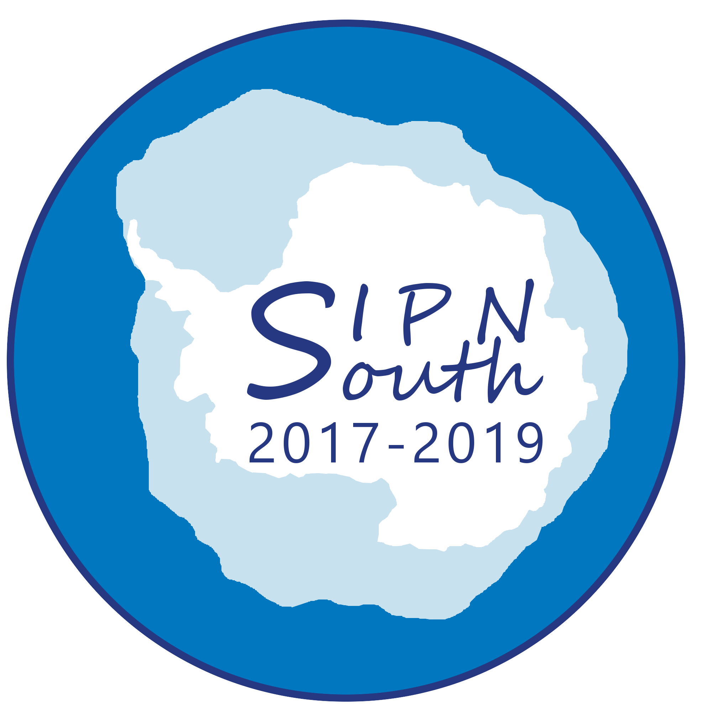
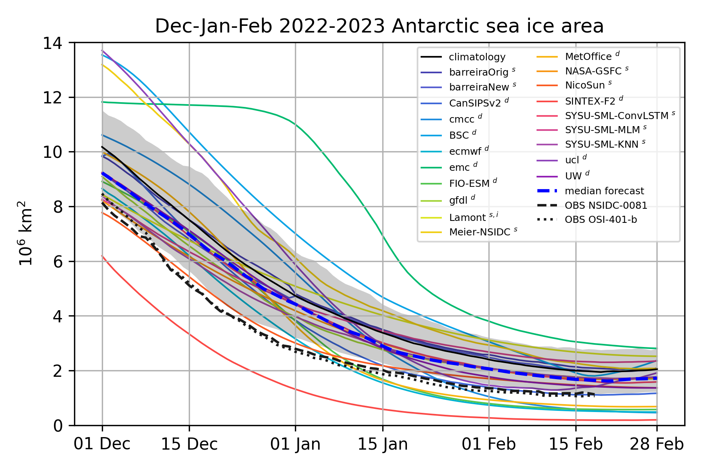

## Welcome to the SIPN South webpage!

 

###  !! NEWS !! 

### Call 2019-2020
The **[call](./doc/2019-2020/SIPNSouth_2019-2020_call.pdf)** for the summer 2019-2020 forecasting exercise is now closed.

### Antarctic at the crossroads
Like many regions of our planet, the Antarctic is currently undergoing profound environmental changes. Not all of these changes are well understood, partly due to a lack of comprehensive observational datasets describing this region. The Antarctic is one of the most under-sampled places on Earth.

In parallel, the need for reliable Antarctic sea-ice predictionsis increasing rapidly. Tourism in the southern polar regions is booming, and intense observing campaigns are planned within the next few years, in the framework of the ongoing [Year Of Polar Prediction](http://www.polarprediction.net/yopp). For operational purposes, sea-ice conditions are one of the many challenges that face vessels operating in the Antarctic coastal region. Some parts of the Antarctic are experiencing expanding sea-ice extent while other areas are seeing multi‐year sea ice persisting in areas where, previously, that was not the norm. These changing conditions impact on science, science support and logistic operations in those regions. Advance notice of seasonal sea-ice conditions would help reduce costs associated with providing alternative operational logistics.

### Scientific goals of SIPN South
SIPN South is driven by the following scientific question:

---
  **_How well do current prediction systems forecast the seasonal evolution of circumpolar and regional Antarctic sea-ice conditions?_** 

---

The project has three strategic objectives:

1. Provide a **focal point for seasonal outlooks of Antarctic sea ice**, where the results are exchanged, compared, discussed and put in perspective with those from the Arctic thanks to interactions within SIPN;

2. Provide news and information on the **state of Antarctic sea ice**, highlight recent published research, report ongoing observational campaigns and disseminate upcoming events (conferences, workshops, webinars, et cetera);

3. Coordinate **realistic prediction exercises** aligned with the Year Of Polar Prediction (YOPP)’s Special Observing Periods.

## Reports, other material and media

* The post-season reports of [2017-2018](./doc/2017-2018/SIPN-South_postseason-Feb-2018.pdf) and [2018-2019](./doc/2018-2019/SIPN-South_2018-2019_postseason.pdf) are available publicly.

*  EGU Cryosphere Blogs contribution

* SIPN South findings after the first forecasting exercise

## Leadership team
François Massonnet, Phil Reid, Cecilia Bitz, John Fyfe, Will Hobbs, Jan Lieser.

     
 

## Contact
[Get in touch](mailto:francois.massonnet@uclouvain.be)
