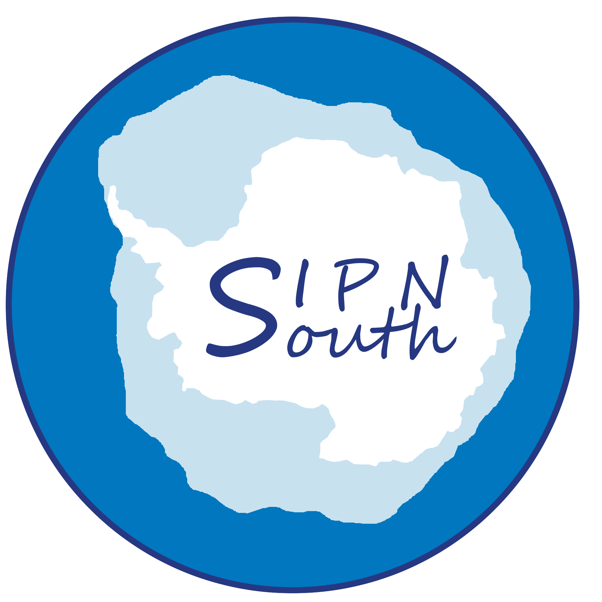
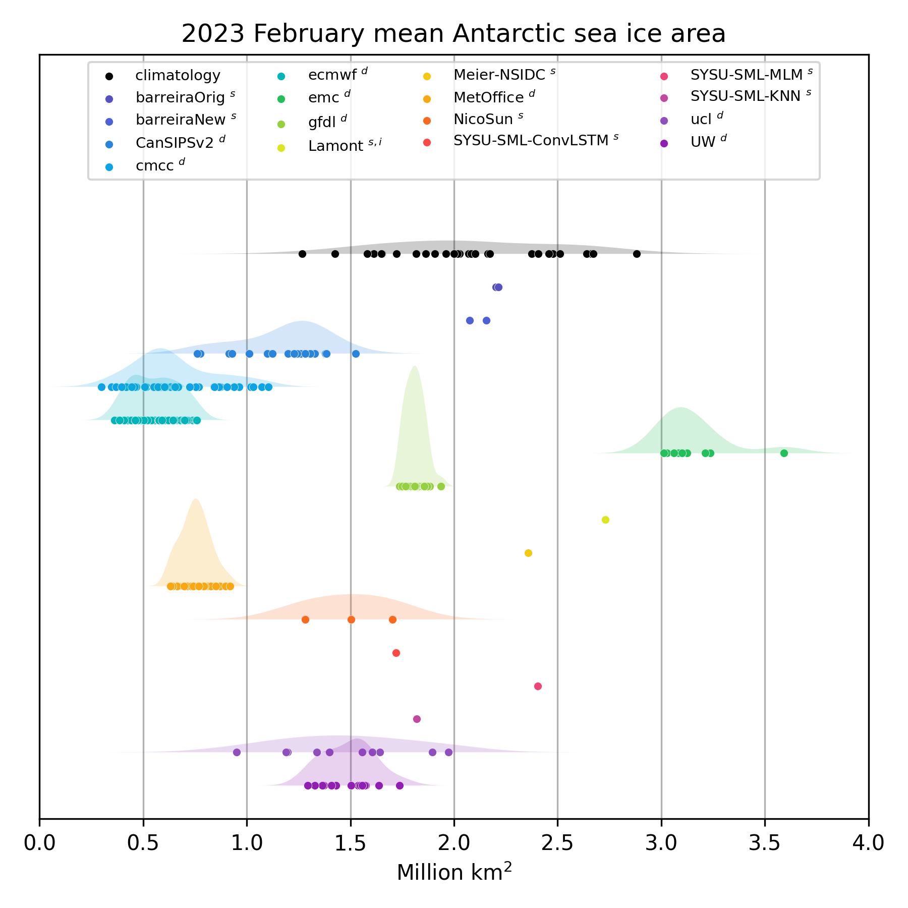

## Welcome to the SIPN South project!

 

###   NEWS 

The post-season report of the 2023-2024 experiment is **[here](./doc/2023-2024/SIPNSouth_2023-2024_postseason.pdf)**

### Paper
The SIPN South paper has been published and is available in open access:

Massonnet, F., Barreira, S., Barthélemy, A., Bilbao, R., Blanchard-Wrigglesworth, E., Blockley, E., Bromwich, D. H., Bushuk, M., Dong, X., Goessling, H. F., Hobbs, W., Iovino, D., Lee, W.-S., Li, C., Meier, W. N., Merryfield, W. J., Moreno-Chamarro, E., Morioka, Y., Li, X., … Yuan, X. (2023). SIPN South: Six years of coordinated seasonal Antarctic sea ice predictions. Frontiers in Marine Science, 10. https://www.frontiersin.org/articles/10.3389/fmars.2023.1148899

###   2022-2023 

For the sixth consecutive year, SIPN South welcomes forecasts of circumpolar and regional sea ice area in the Southern Ocean. If you are interested in contributing, see the general procedure **[here](./doc/2022-2023/SIPNSouth_2022-2023_call.pdf)**

**Fig. 1** _The 2022-2023 daily sea ice area forecasts from the SIPN South ensemble (colors). The superscripts indicate whether the contribution is from dynamical or from statistical models. The dashed blue line is the ensemble median. The black thick line is the observed 30-yr climatological mean and the grey shading represents the climatological range (min-max). The dashed lines are the observed values from two satellite datasets_

**Fig. 2** _Forecast distributions of the February 2023 mean Antarctic sea ice area, including the climatology (black)_

The call for the 2022-2023 experiment is **[here](./doc/2022-2023/SIPNSouth_2022-2023_call.pdf)**

### 2021-2022
The post-season report of the summer 2021-2022 experiment is available **[here](./doc/2021-2022/SIPN-South_2021-2022_postseason.pdf)**

An initial assessment of the 2021-2022 forecasts is available **[here](./doc/2021-2022/SIPNSouth_initialassessment_2021-2022.pdf)**. 

The original call is **[here](./doc/2021-2022/SIPNSouth_2021-2022_call.pdf)**.

###  2020-2021
An initial assessment of the 2020-2021 forecasts is available **[here](./doc/2020-2021/SIPNSouth_initialassessment_2020-2021.pdf)**. 

The original call is **[here](./doc/2020-2021/SIPNSouth_2020-2021_call.pdf)**.

### 2019-2020
The post-season report of the summer 2019-2020 experiment is available **[here](./doc/2019-2020/SIPN-South_2019-2020_postseason.pdf)**.

An initial assessment of the 2019-2020 forecasts is available **[here](./doc/2019-2020/SIPNSouth_initialassessment_2019-2020.pdf)**.

The original call is **[here](./doc/2019-2020/SIPNSouth_2019-2020_call.pdf)**

### 2018-2019
The post-season report of the summer 2018-2019 experiment is available **[here](./doc/2018-2019/SIPN-South_2018-2019_postseason.pdf)**.

An initial assessment of the 2018-2019 forecasts is available **[here](./doc/2018-2019/SIPNSouth_initialassessment_2018-2019.pdf)**.

The original call is **[here](./doc/2018-2019/SIPNSouth_2018-2019_call.pdf)**

### 2017-2018
The post-season report of the summer 2017-2018 experiment is available **[here](./doc/2017-2018/SIPN-South_2017-2018_postseason.pdf)**.

An initial assessment of the 2017-2018 forecasts is available **[here](./doc/2017-2018/SIPNSouth_initialassessment_2017-2018.pdf)**.

The original call is **[here](./doc/2017-2018/SIPNSouth_2017-2018_call.pdf)**

### Antarctic at the crossroads
Like many regions of our planet, the Antarctic is currently undergoing profound environmental changes. Not all of these changes are well understood, partly due to a lack of comprehensive observational datasets describing this region. The Antarctic is one of the most under-sampled places on Earth.

In parallel, the need for reliable Antarctic sea-ice predictionsis increasing rapidly. Tourism in the southern polar regions is booming, and intense observing campaigns are planned within the next few years, in the framework of the ongoing [Year Of Polar Prediction](http://www.polarprediction.net/yopp). For operational purposes, sea-ice conditions are one of the many challenges that face vessels operating in the Antarctic coastal region. Some parts of the Antarctic are experiencing expanding sea-ice extent while other areas are seeing multi‐year sea ice persisting in areas where, previously, that was not the norm. These changing conditions impact on science, science support and logistic operations in those regions. Advance notice of seasonal sea-ice conditions would help reduce costs associated with providing alternative operational logistics.

### Scientific goals of SIPN South
SIPN South is driven by the following scientific question:

---
  **_How well do current prediction systems forecast the seasonal evolution of circumpolar and regional Antarctic sea-ice conditions?_** 

---

The project has three strategic objectives:

1. Provide a **focal point for seasonal outlooks of Antarctic sea ice**, where the results are exchanged, compared, discussed and put in perspective with those from the Arctic thanks to interactions within SIPN;

2. Provide news and information on the **state of Antarctic sea ice**, highlight recent published research, report ongoing observational campaigns and disseminate upcoming events (conferences, workshops, webinars, et cetera);

3. Coordinate **realistic prediction exercises** aligned with the Year Of Polar Prediction (YOPP)’s Special Observing Periods.

### Open science and data access

The data collected in the project is reusable under the Creative Commons license. The SIPN South project can be cloned at the following [Github URL](https://github.com/fmassonn/sipn-south-public). 

## Reports, other material and media

*  EGU Cryosphere Blogs contribution

* SIPN South findings after the first forecasting exercise

## Leadership team
François Massonnet, Phil Reid, Cecilia Bitz, John Fyfe, Will Hobbs, Jan Lieser.

     
 

## Contact
[Get in touch](mailto:francois.massonnet@uclouvain.be)
